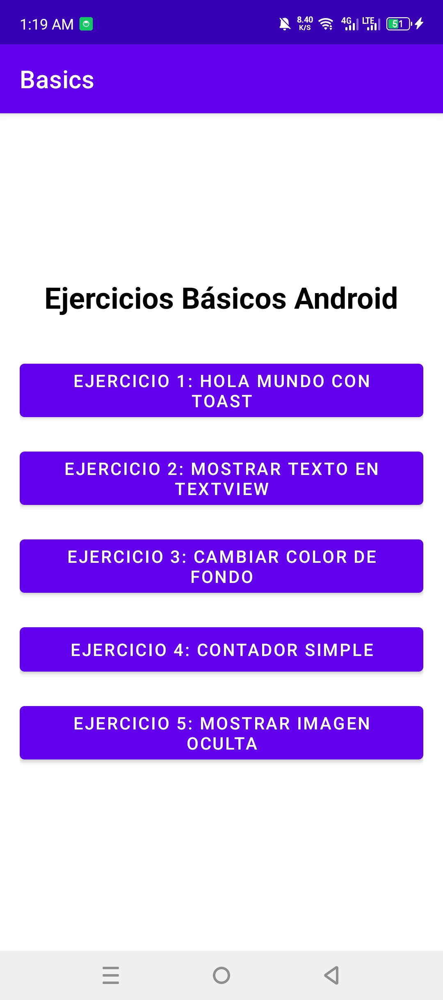
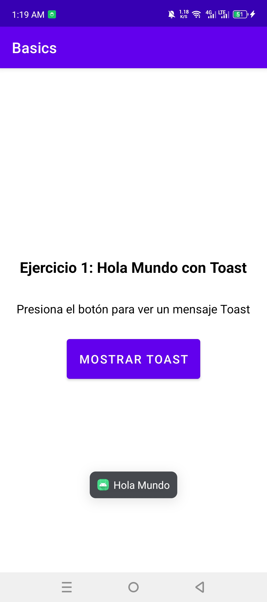
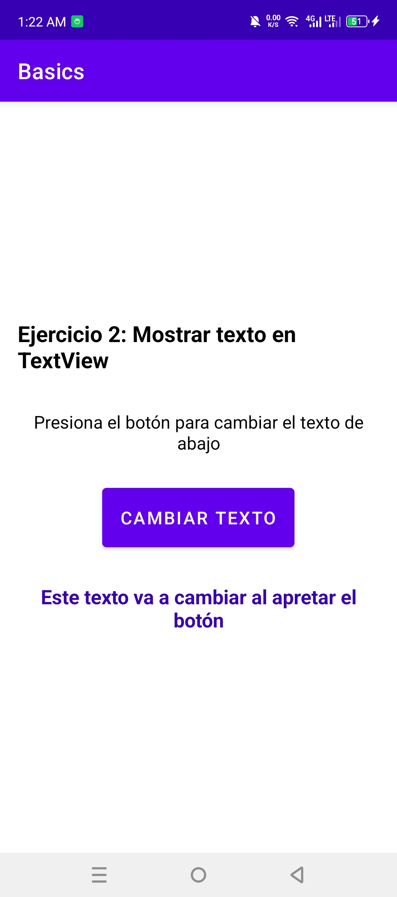
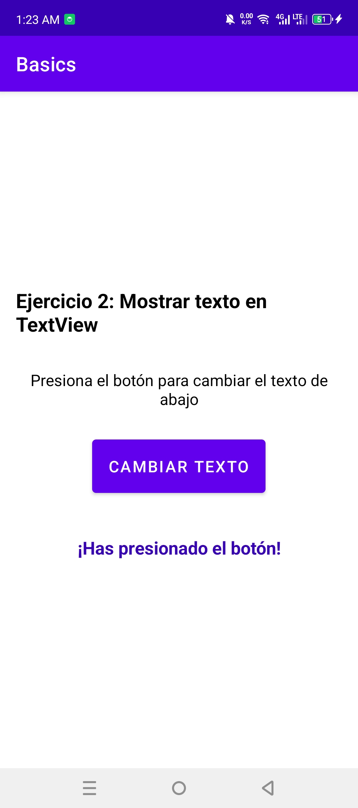
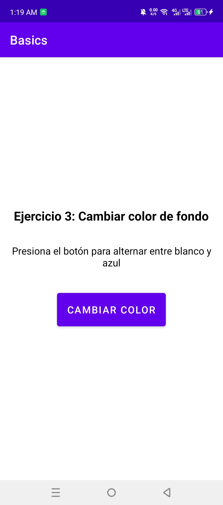
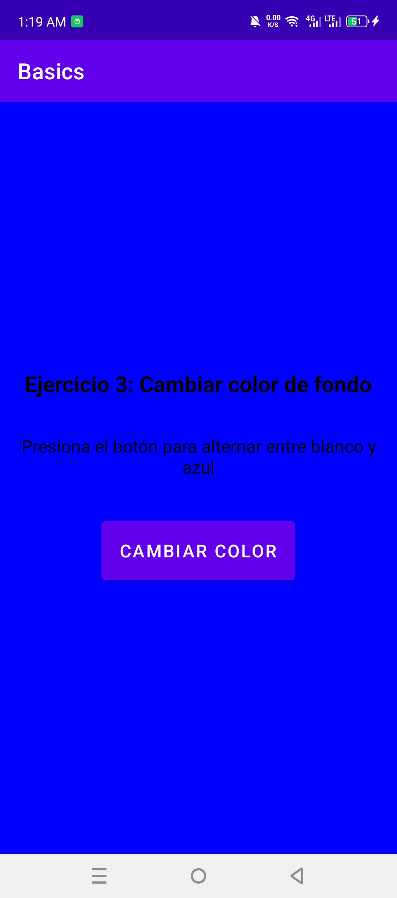
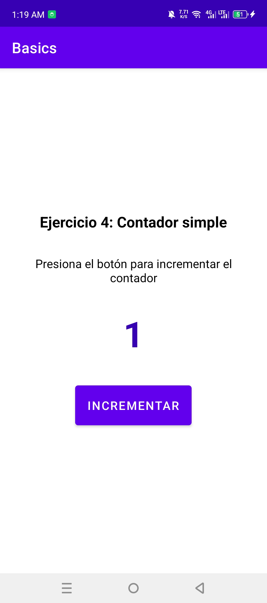
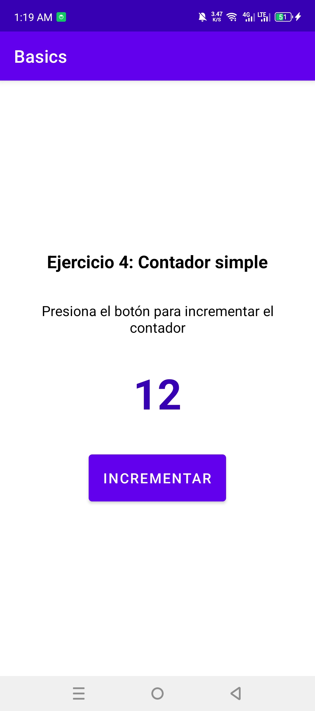
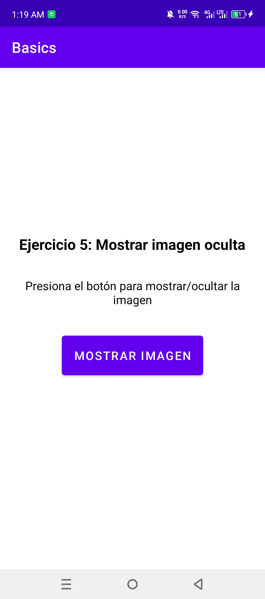
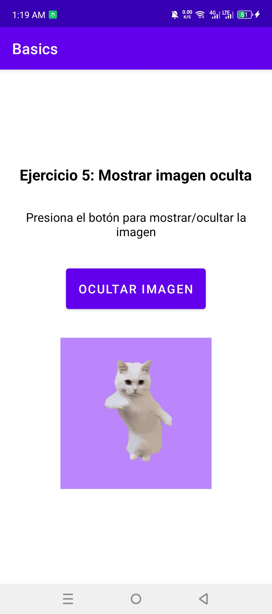

# Ejercicios Básicos de Android Studio con Kotlin

## CAPTURAS DE PANTALLA













Este proyecto contiene la implementación de 5 ejercicios básicos para aprender desarrollo en Android Studio usando Kotlin.

## Estructura del Proyecto

El proyecto está organizado con una actividad principal (`MainActivity`) que permite navegar a cada uno de los 5 ejercicios implementados en actividades separadas.

## Ejercicios Implementados

### 1. Ejercicio 1: Hola Mundo con Toast

**Ubicación:** `Ejercicio1Activity.kt`

**Descripción:** 
Esta actividad contiene un botón que, al ser presionado, muestra un mensaje Toast con el texto "Hola Mundo".

**Funcionamiento:**
- La actividad se inicia con un botón visible
- Al presionar el botón, se ejecuta un listener que llama a `Toast.makeText()`
- El Toast muestra el mensaje "Hola Mundo" durante un tiempo corto

**Código clave:**
```kotlin
btnMostrarToast.setOnClickListener {
    Toast.makeText(this, "Hola Mundo", Toast.LENGTH_SHORT).show()
}
```

---

### 2. Ejercicio 2: Mostrar texto en TextView

**Ubicación:** `Ejercicio2Activity.kt`

**Descripción:** 
Esta actividad tiene un botón y un TextView que inicialmente muestra "Este texto va a cambiar al apretar el botón". Al presionar el botón, el TextView cambia para mostrar "¡Has presionado el botón!".

**Funcionamiento:**
- La actividad inicia con un TextView que muestra un mensaje inicial y un botón
- Al presionar el botón, se actualiza el contenido del TextView
- El texto cambia de "Este texto va a cambiar al apretar el botón" a "¡Has presionado el botón!"

**Código clave:**
```kotlin
btnCambiarTexto.setOnClickListener {
    tvTexto.text = "¡Has presionado el botón!"
}
```

---

### 3. Ejercicio 3: Cambiar color de fondo

**Ubicación:** `Ejercicio3Activity.kt`

**Descripción:** 
Esta actividad permite alternar el color de fondo de la pantalla entre blanco y azul cada vez que se presiona un botón.

**Funcionamiento:**
- La actividad mantiene una variable booleana `esColorBlanco` para controlar el estado
- Al presionar el botón, se verifica el estado actual y se cambia al color opuesto
- Los colores alternan entre blanco (`Color.WHITE`) y azul (`Color.BLUE`)

**Código clave:**
```kotlin
btnCambiarColor.setOnClickListener {
    if (esColorBlanco) {
        layoutPrincipal.setBackgroundColor(Color.BLUE)
        esColorBlanco = false
    } else {
        layoutPrincipal.setBackgroundColor(Color.WHITE)
        esColorBlanco = true
    }
}
```

---

### 4. Ejercicio 4: Contador simple

**Ubicación:** `Ejercicio4Activity.kt`

**Descripción:** 
Esta actividad implementa un contador que inicia en 0 y se incrementa en 1 cada vez que se presiona un botón.

**Funcionamiento:**
- La actividad mantiene una variable `contador` que inicia en 0
- Un TextView muestra el valor actual del contador
- Al presionar el botón, se incrementa el contador y se actualiza la visualización

**Código clave:**
```kotlin
btnIncrementar.setOnClickListener {
    contador++
    tvContador.text = contador.toString()
}
```

---

### 5. Ejercicio 5: Mostrar imagen oculta

**Ubicación:** `Ejercicio5Activity.kt`

**Descripción:** 
Esta actividad tiene un botón y una imagen animada de un gato bailando (ImageView) que inicialmente está oculta. Al presionar el botón, la imagen se muestra con animación o se oculta alternativamente.

**Funcionamiento:**
- La imagen animada inicia con `visibility = View.GONE`
- Al presionar el botón, se verifica el estado de visibilidad actual
- Se alterna entre `View.VISIBLE` y `View.GONE`
- El texto del botón también cambia entre "Mostrar Imagen" y "Ocultar Imagen"
- Cuando se muestra, inicia la animación del gato bailando

**Código clave:**
**Código clave:**
```kotlin
btnMostrarImagen.setOnClickListener {
    if (ivImagen.visibility == View.GONE) {
        ivImagen.visibility = View.VISIBLE
        btnMostrarImagen.text = "Ocultar Imagen"
        // Cargar el GIF del gato bailando
        ivImagen.setImageResource(R.drawable.cat_dancing)
    } else {
        ivImagen.visibility = View.GONE
        btnMostrarImagen.text = "Mostrar Imagen"
    }
}
```

## Tecnologías Utilizadas

- **Lenguaje:** Kotlin
- **IDE:** Android Studio
- **SDK mínimo:** API 26 (Android 8.0)
- **SDK objetivo:** API 36
- **Layouts:** LinearLayout
- **Componentes UI:** Button, TextView, ImageView, Toast

## Cómo ejecutar el proyecto

1. Abrir Android Studio
2. Importar el proyecto desde la carpeta raíz
3. Sincronizar el proyecto con Gradle
4. Ejecutar la aplicación en un emulador o dispositivo físico
5. Navegar a cada ejercicio desde la pantalla principal

## Estructura de archivos

```
app/src/main/
├── java/com/example/basics/
│   ├── MainActivity.kt              # Pantalla principal con navegación
│   ├── Ejercicio1Activity.kt        # Toast
│   ├── Ejercicio2Activity.kt        # TextView
│   ├── Ejercicio3Activity.kt        # Cambiar color
│   ├── Ejercicio4Activity.kt        # Contador
│   └── Ejercicio5Activity.kt        # Imagen oculta
├── res/layout/
│   ├── activity_main.xml
│   ├── activity_ejercicio1.xml
│   ├── activity_ejercicio2.xml
│   ├── activity_ejercicio3.xml
│   ├── activity_ejercicio4.xml
│   └── activity_ejercicio5.xml
└── AndroidManifest.xml              # Registro de actividades
```

## Capturas de pantalla

*Nota: Para ejecutar y obtener capturas de pantalla, compile y ejecute la aplicación en Android Studio.*

### Pantalla Principal
La pantalla principal muestra 5 botones que permiten navegar a cada ejercicio.

### Ejercicio 1 - Toast
Muestra un botón que al presionarse genera un mensaje Toast.

### Ejercicio 2 - TextView
Botón que modifica el contenido de un TextView.

### Ejercicio 3 - Color de fondo
Botón que alterna el color de fondo entre blanco y azul.

### Ejercicio 4 - Contador
Contador numérico que se incrementa con cada presión del botón.

### Ejercicio 5 - Imagen oculta
Botón que muestra/oculta una imagen alternadamente.

---

**Fecha:** Octubre 2025  
**Versión:** 1.0